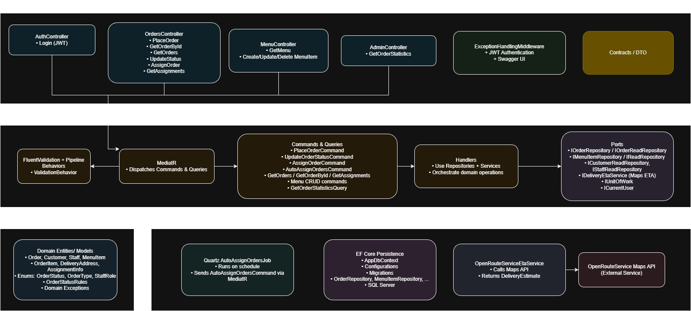
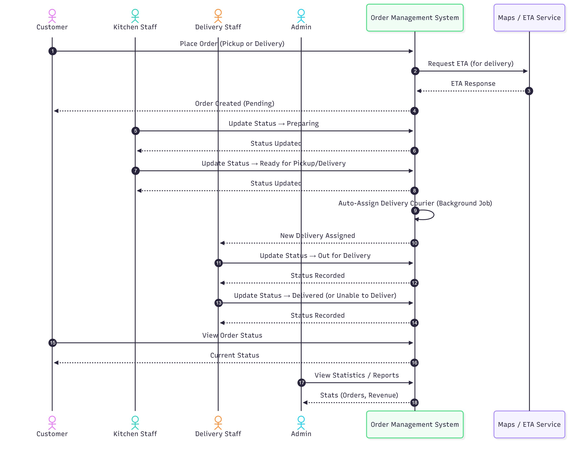

# Order Management System


A .NET 8 minimal API for Order Management System (OMS) for a takeaway restaurant that supports the complete lifecycle of an order, including preparation and delivery. 

## Features

1. Customer Features:
    - Place an order by selecting items from a menu (include e.g. customer details, quantities, special instructions etc.). Include a pickup or delivery option.
    - View the status of an order:
        - For Pickup: “Pending”, “Preparing”, “Ready for Pickup.”
        - For Delivery: “Pending”, “Preparing”, “Ready for delivery”, “Out for Delivery,” “Delivered.”

2.	Restaurant Staff Features:
    - View a list of orders with their details and statuses with optional filters (e.g., by status or customer).
    - Update the status of an order:
        - Move orders through preparation stages up to “Ready for Pickup” or “Ready for Delivery.”
        - Cancel an order if it has not yet been prepared.
    -	Assign orders to delivery staff.

3.	Delivery Staff Features:
    - View user delivery assignments (orders marked as “Out for Delivery”).
    - Update the status of an order to “Delivered” or “Unable to Deliver”

4.	Admin Features:
    - Manage menu items (add, update, delete menu items).
    - View some useful statistics (e.g. average order fulfillment time etc.)

5. Dummy Authentication with stateless JWTs (no refresh/logout for simplicity - only userid as "login") and role-based access control (e.g., customer, staff, delivery personnel, admin).

6. Integration with a mapping API (OpenRouteService) to calculate estimated delivery times.

7. Dummy Routing module to automatically assign orders to delivery staff.

8. Rate limiter

9. Dummy logging + exception handling

## Architecture



| Concern | Tech |
|---|---|
| Architecture style | Clean Architecture + Ports |
| Use-cases | CQRS + MediatR |
| Domain rules | DDD (Entities, Rules) |
| Resilience / Cross-cutting | Exception Middleware, Rate Limiting, FluentValidation |
| Storage | SQL Server + EF Core |
| Tests | xUnit |

---

## Project Structure (high level)

```jsonc
src/
  OrderManagement.API/                # Minimal APIs, middleware, rate limiting, DI
  OrderManagement.Application/        # Commands/Queries (MediatR), validators, ports
  OrderManagement.Contracts/          # DTOs (Requests, Responses), Error format
  OrderManagement.Domain/             # Entities, Domain Exceptions, Rules
  OrderManagement.Infrastructure/     # EF Core, Repositories, Jobs, External HTTP Calls
tests/
  OrderManagement.UnitTests/          # xUnit: domain rules, handlers, validators
```

## Sequence diagram of the order 



## Seed Data

The database is initialized with some demo data via the initial EF Core migration.
You can use these IDs directly when testing the API or obtaining JWT tokens.

### Customers

| ID                                   | Name           | Phone              | Email               |
|--------------------------------------|----------------|--------------------|---------------------|
| `11111111-1111-1111-1111-111111111111` | Alice Johnson  | `+30 690 000 0001` | `alice@example.com`  |
| `22222222-2222-2222-2222-222222222222` | Bob Smith      | `+30 690 000 0002` | `bob@example.com`    |
| `33333333-3333-3333-3333-333333333333` | Charlie Brown  | `+30 690 000 0003` | `charlie@example.com`|

### Staff

| ID                                   | Name            | Role      | IsActive |
|--------------------------------------|-----------------|-----------|----------|
| `aaaaaaaa-aaaa-aaaa-aaaa-aaaaaaaaaaaa` | Admin User      | Admin     | true     |
| `bbbbbbbb-bbbb-bbbb-bbbb-bbbbbbbbbbbb` | Kitchen Staff 1 | Kitchen   | true     |
| `cccccccc-cccc-cccc-cccc-cccccccccccc` | Kitchen Staff 2 | Kitchen   | true     |
| `dddddddd-dddd-dddd-dddd-dddddddddddd` | Courier 1       | Delivery  | true     |
| `eeeeeeee-eeee-eeee-eeee-eeeeeeeeeeee` | Courier 2       | Delivery  | true     |

\* These IDs are used as userId in the simplified /api/v1/auth/login endpoint (combined with the isStaff flag) to issue JWT tokens for different roles.

### Menu Items

| ID                                   | Name             | Category | Price | Available |
|--------------------------------------|------------------|----------|-------|-----------|
| `10000000-0000-0000-0000-000000000001` | Margherita Pizza | Pizza    | 8.50  | true      |
| `10000000-0000-0000-0000-000000000002` | Pepperoni Pizza  | Pizza    | 9.50  | true      |
| `10000000-0000-0000-0000-000000000003` | Caesar Salad     | Salad    | 7.00  | true      |
| `10000000-0000-0000-0000-000000000004` | Chicken Burger   | Burger   | 8.90  | true      |
| `10000000-0000-0000-0000-000000000005` | French Fries     | Sides    | 3.50  | true      |

## Running the Service

**Try New York addresses like "123 East 45th Street, New York, NY 10017"**

### Local (HTTP) — easiest setup
Select the **OrderManagement.API (HTTP)** debug profile.

1) Replace API Key of OpenRouteService

\* EF migrations auto-create the database (LocalDB) and tables/data

### Docker / External SQL Server
Steps
1) Uncomment the alternative connection string in `appsettings.Development.json`:

```jsonc
//"ConnectionString": "Server=host.docker.internal,1433;Database=OrderManagement;User Id=ordermanagement_app;Password=StrongPassword123!;Encrypt=True;TrustServerCertificate=True"
```
2) Enable SQL Auth + TCP 1433
3) Execute script:
```sql
CREATE DATABASE OrderManagement;
GO
USE OrderManagement;
GO
CREATE LOGIN ordermanagement_app WITH PASSWORD = 'StrongPassword123!';
CREATE USER  ordermanagement_app FOR LOGIN ordermanagement_app;
EXEC sp_addrolemember N'db_datareader', N'ordermanagement_app';
EXEC sp_addrolemember N'db_datawriter', N'ordermanagement_app';
EXEC sp_addrolemember N'db_ddladmin',   N'ordermanagement_app';
```
4) Replace API Key of OpenRouteService

\* EF migrations auto-create the tables/data

## Assumptions / Future improvement ideas

- If menu/orders grows large, we could add paging parameters. For simplicity it was skipped.
- Customers/Staff management was skipped for simplicity and initialized only with Migrations / Mock data.
- We could add a 2 level cache layer (Memory cache + Redis - Decorator Pattern) for menu or customers/staff for better performance. For simplicity it was skipped.
- It's not an application I would expect lots of exceptions. In case of many exceptions and many RPS Result pattern should be consired. Result pattern leads to long lines of code and I avoid it if not nessasary.
- Refit is a library that could be considered to be used but in the architecture of the project the interface is a port in Application. Application should not know url/header related info.
- The exception model intentionally remains simple. In real-world systems, we might introduce structured error taxonomies, centralized registries, or Roslyn source generators to eliminate reflection and precompute metadata for higher performance.
- JWT tokens should not be stateless and logout/refresh functionalities should be added. Login should not have only userid as "login".
- Delivery time should be calculated by including the time for preparation somehow. For simplicity it was skipped.
- More thorough and sophisticated Unit Tests.
- Add Integration Tests.